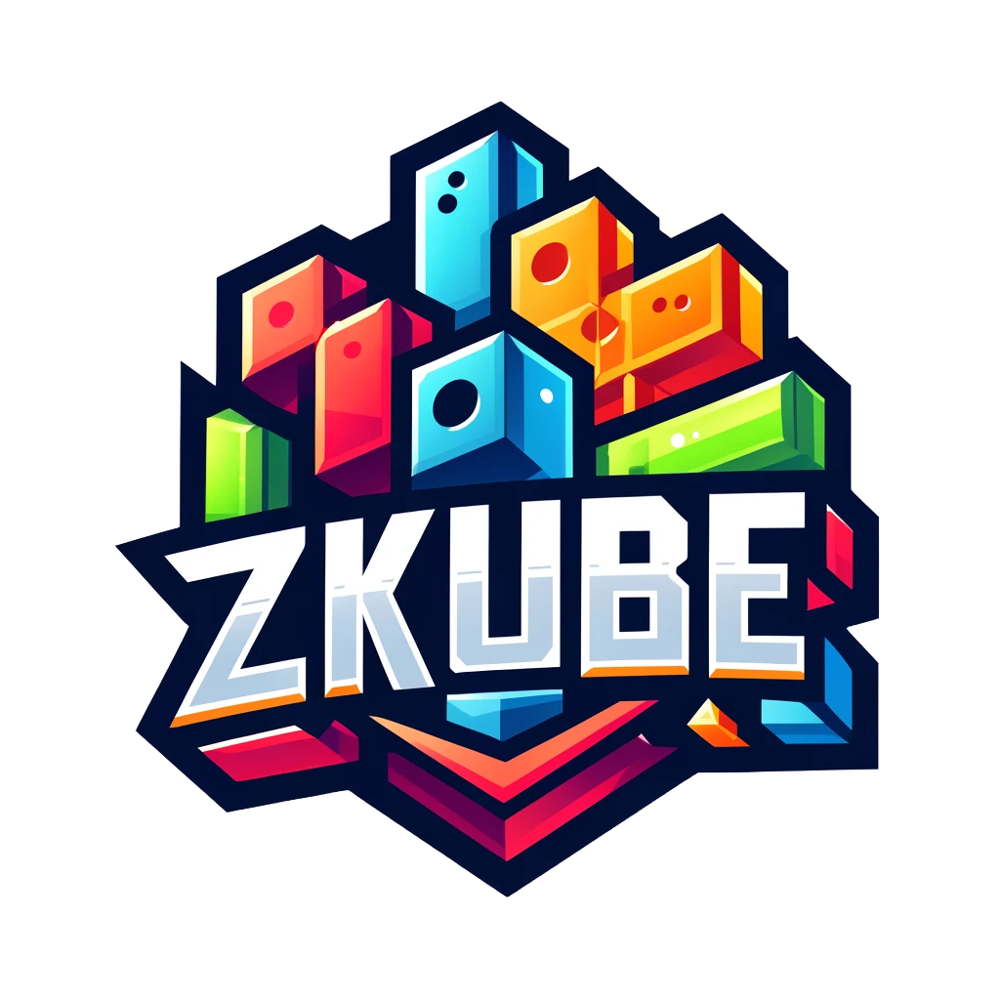
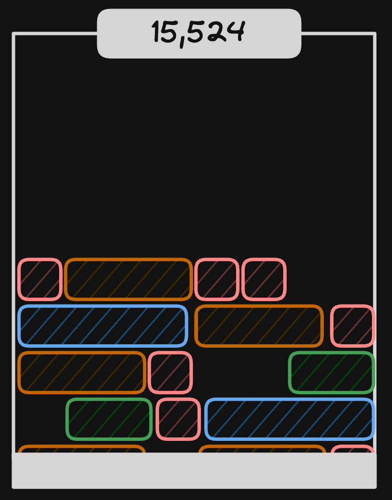
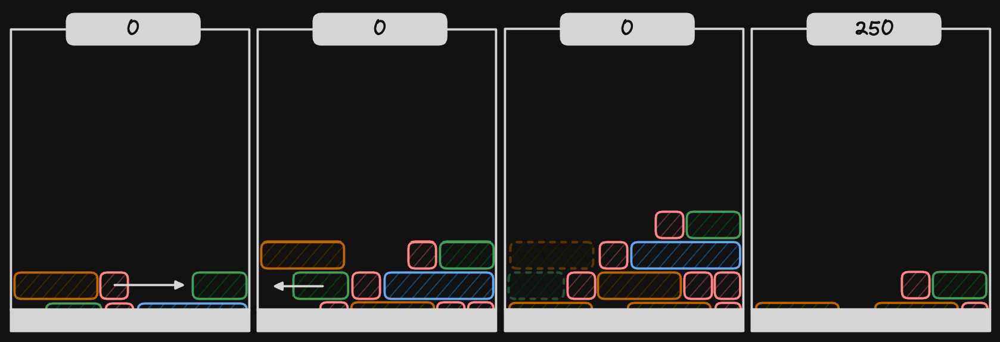

# zKube

  

A fully on-chain game, with Dojo on Starknet.

## Overview

zKube is an engaging puzzle game that puts players' strategic thinking to the test. Set within a dynamic grid, the objective is simple: manipulate falling blocks to form solid lines and earn points. Each turn, a new line of blocks emerges from the bottom of the grid, and players have the opportunity to slide any block horizontally to strategically position them. The challenge lies in clearing lines efficiently to prevent the grid from filling up. With no notion of speed or acceleration, zKube offers a purely reflective gameplay experience, allowing players to focus solely on their puzzle-solving skills. Are you ready to dive into the world of zKube and master its captivating challenges?

  

## Gameplay

In zKube, players face the task of managing a grid populated by falling blocks. After each player turn, a new line of blocks appears at the bottom of the grid. Players can then strategically slide any block horizontally to arrange them in a manner that clears lines. Clearing a line rewards players with points, and bonus points are awarded for clearing multiple lines simultaneously. However, the challenge intensifies as the grid fills up, requiring players to think critically about each move to prevent the grid from reaching capacity. With its emphasis on thoughtful decision-making and puzzle-solving, zKube promises an immersive gameplay experience that will keep players engaged for hours on end.

  

## Team

At the heart of zKube is the dedicated team of developers from zKorp. With their expertise and passion for gaming, they have brought this innovative puzzle experience to life. As the creators of zKube, the zKorp team is committed to delivering quality gameplay and engaging challenges to players worldwide. We welcome collaboration and encourage aspiring developers to join us on our journey. If you're interested in contributing to zKube or exploring the Starknet dojo framework, we invite you to reach out and become part of the dojo growing community. Together, let's shape the future of gaming.

- [Bal7hazar](https://github.com/Bal7hazar)
- [Matthias](https://github.com/Matth26)
- [Cheelax](https://github.com/Cheelax)
- [Cosmos](https://github.com/ClanCo)
- You?