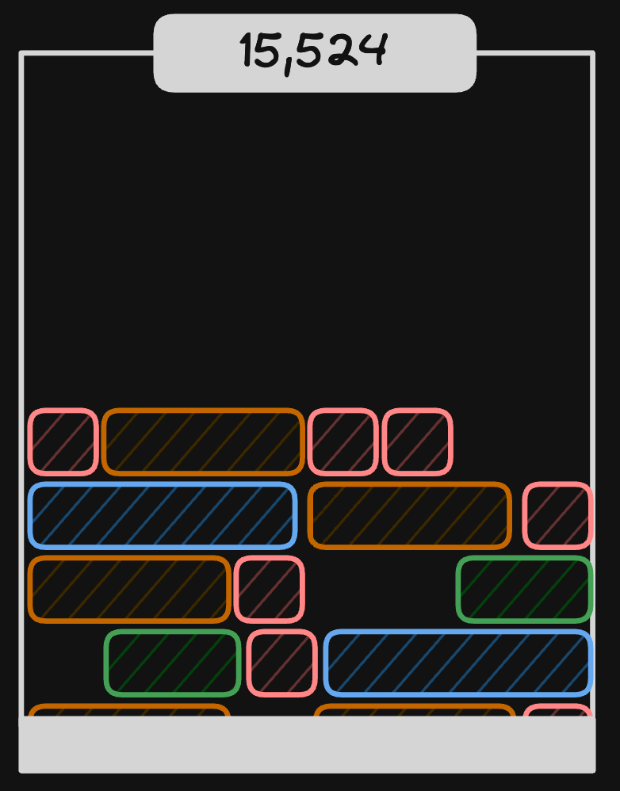
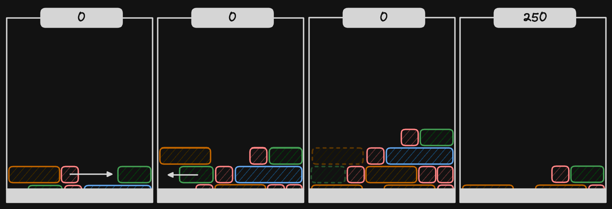

# zKube

<p align="center">
  
</p>

A fully on-chain puzzle roguelike built with [Dojo](https://dojoengine.org/) on [Starknet](https://starknet.io/).

## Overview

zKube challenges players to manipulate blocks on an 8x10 grid to form solid horizontal lines. Progress through 50 levels, earn CUBE tokens, unlock bonuses, and complete daily quests. Every action is verified on-chain with VRF-powered randomness.

<p align="center">
  
</p>

## Key Features

- **50-Level Campaign** - Progressive difficulty from VeryEasy to Master
- **5 Bonus Types** - Combo, Score, Harvest, Wave, Supply (each with 3 upgrade levels)
- **CUBE Economy** - Earn tokens through gameplay, spend on permanent upgrades
 **Daily Quests** - 13 quests with 92 CUBE rewards per day
- **28 Achievements** - Track lifetime progress across multiple categories
- **Boss Levels** - Special challenges every 10 levels with bonus rewards

## Gameplay

Slide blocks horizontally to form complete lines. Each cleared line awards points and builds combos. Clear the level's point target within the move limit to advance. Use bonuses strategically to clear difficult situations.

<p align="center">
  
</p>

## Quick Start

### Play

Visit [app.zkube.xyz](https://app.zkube.xyz) to play on mainnet.

### Development

```bash
# Frontend
cd client-budokan
pnpm install
pnpm slot        # Local development
pnpm sepolia     # Sepolia testnet

# Contracts
scarb build                    # Build all packages
cd contracts && scarb test     # Run tests
```

See [AGENTS.md](./AGENTS.md) for execution-critical guidance and [docs/PROJECT_REFERENCE.md](./docs/PROJECT_REFERENCE.md) for architecture/current behavior.

## Documentation

| Document | Description |
|----------|-------------|
| [AGENTS.md](./AGENTS.md) | Primary agent instructions and high-signal workflow notes |
| [CLAUDE.md](./CLAUDE.md) | Root pointer to canonical knowledge docs |
| [docs/PROJECT_REFERENCE.md](./docs/PROJECT_REFERENCE.md) | Current architecture, MVP semantics, and config reference |
| [docs/DEPLOY_RUNBOOK.md](./docs/DEPLOY_RUNBOOK.md) | Deploy/migrate runbook for Slot and contract changes |
| [docs/ASSET_PIPELINE.md](./docs/ASSET_PIPELINE.md) | Asset generation commands and data sources |

## Technology Stack

- **Contracts**: Cairo 2.13.1 / Dojo 1.8.0
 **Frontend**: React 19 / TypeScript / Vite
- **Blockchain**: Starknet
- **Wallet**: Cartridge Controller

## Links

- [Website](https://app.zkube.xyz)
- [Twitter](https://x.com/zKube_game)
- [Discord](https://discord.gg/pzzRSDZY)
- [GitHub](https://github.com/z-korp/zkube)

## Team

zKube is developed by [zKorp](https://github.com/z-korp). We welcome contributions - feel free to open issues or pull requests.

## License

MIT
