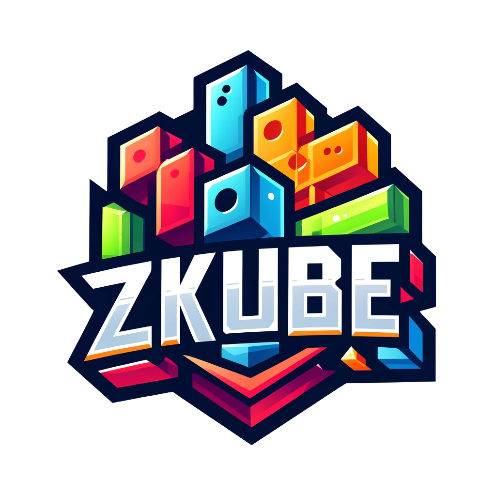

# Milestones

  

## Current Version: 1.2.0

> **Namespace:** `zkube_budo_v1_2_0`  
> **Last Updated:** January 2026

## Completed Features

### Core Game (v1.0.0)
- [x] Contract development with Dojo 1.8.0 framework
- [x] Grid manipulation and block physics
- [x] Line clearing and gravity mechanics
- [x] Score and combo tracking
- [x] Bonus system (Hammer, Wave, Totem)
- [x] VRF-based randomness for block generation

### Client (v1.0.0)
- [x] React-based client optimized for mobile
- [x] Dojo SDK integration with RECS state sync
- [x] Cartridge Controller authentication
- [x] Responsive grid with drag/drop controls

### Level System (v1.1.0 → v1.2.0)
- [x] Seed-based level generation (`helpers/level.cairo`)
- [x] 100+ level progression with difficulty scaling
- [x] Constraint system (ClearLines, NoBonusUsed)
- [x] Cube rating (1-3 cubes based on move efficiency)
- [x] Level transitions with events
- [x] Bonus earning based on score/combo thresholds

### Cube Economy (v1.2.0)
- [x] CUBE token (soulbound ERC1155)
- [x] Combo bonuses (4+/5+/6+ lines = +1/+2/+3 cubes)
- [x] Achievement bonuses (first 5x combo = +3, first 10x = +5)
- [x] Level completion cubes (1-3 based on efficiency)
- [x] Permanent Shop (starting bonuses, bag size, bridging rank)
- [x] In-Game Shop (consumable bonuses every 5 levels)
- [x] Cube bridging (`create_with_cubes`)
- [x] Cube minting at game over

### Deployment
- [x] Slot (local development)
- [x] Sepolia testnet
- [x] Mainnet

## In Progress / Planned

### Near Term
- [ ] Milestone bonuses (level/2 cubes every 10 levels)
- [ ] ExtraMoves consumable
- [ ] Daily Challenge mode

### Future
- [ ] Tournament mode with entry fees
- [ ] Leaderboard UI
- [ ] Revival system
- [ ] Additional consumables (Full Refill, Skip Constraint)

## Technical Stack

| Component | Technology |
|-----------|------------|
| Contracts | Cairo 2.13.1, Dojo 1.8.0 |
| Frontend | React 18, TypeScript, Vite |
| State Management | Zustand, MobX, Dojo RECS |
| Wallet | Cartridge Controller |
| Token | game-components FullTokenContract (ERC721) |
| Currency | Soulbound ERC1155 CUBE token |

## Related Documentation

- [Level System](./LEVEL_SYSTEM_IMPLEMENTATION.md) - Level generation and constraints
- [Cube Economy](./CUBE_ECONOMY.md) - Token economics and shops
- [Deployment Guide](./DEPLOYMENT_GUIDE.md) - Network deployment instructions
